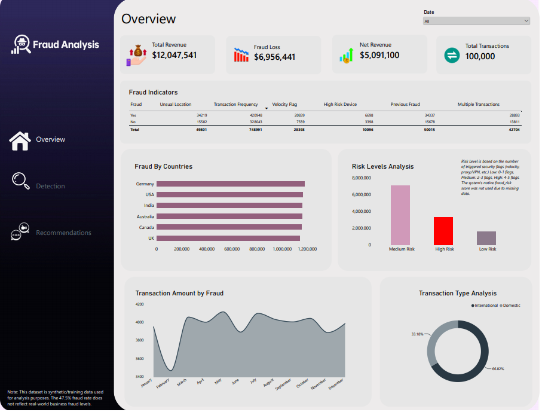
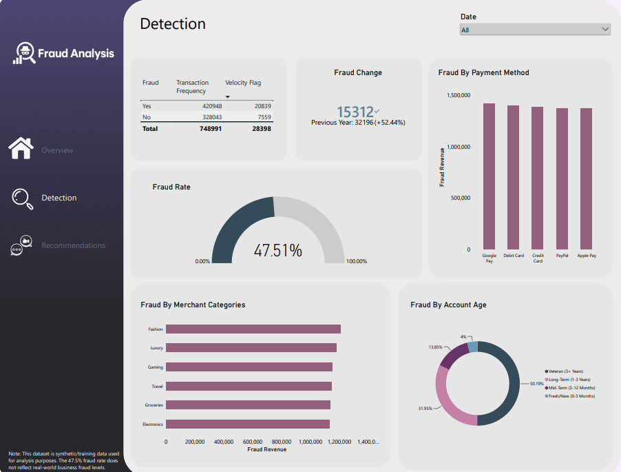
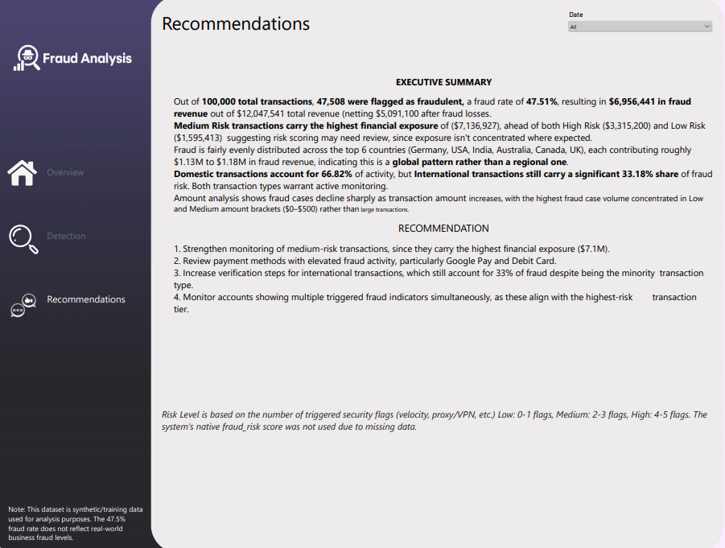

# Fraud Analysis

An end-to-end fraud analytics project — cleaning 100,000 raw retail transaction records in SQL, then building an interactive 3-page Power BI dashboard to identify fraud patterns, assess risk exposure, and support fraud monitoring decisions.

## The Problem

Retail businesses lose money through fraudulent transactions and ineffective fraud monitoring. This project focuses on identifying where fraud occurs, understanding the indicators associated with suspicious transactions, and translating the findings into practical recommendations for risk management.

## Data Cleaning (SQL)

The raw dataset required several cleaning and preparation steps before analysis:

- Removed duplicate transaction records
- Standardized inconsistent formatting across fields
- Identified and handled nulls/blanks in key columns

Full script: [Fraud Queries.sql](./Fraud%20Queries.sql)

## Data Quality Issues Found

Two important data quality issues were identified during profiling:

- The dataset's native `fraud_risk` score field was completely corrupted — flatlined at 0.0 across all 100,000 records, making it unsuitable for analysis.
- `is_international` and `unusual_location_flag` were found to contain duplicate information, so only one was retained to avoid redundant reporting.

Rather than creating or simulating a risk score, a transparent **Risk Level** classification was built from the number of legitimate security flags triggered by each transaction:

- **Low Risk:** 0–1 flags triggered
- **Medium Risk:** 2–3 flags triggered
- **High Risk:** 4–5 flags triggered

The methodology is disclosed directly on the dashboard so that the classification is not mistaken for an original dataset field.

This is a synthetic/training dataset with a fraud rate of approximately 47.5%, so the results should not be interpreted as representative of real-world fraud levels.

## Dashboard Pages

### 1. Overview

The Overview page provides an executive-level view of the fraud landscape through:

- Total Revenue
- Fraud Loss
- Net Revenue
- Total Transactions
- Fraud Indicators
- Fraud by Country
- Risk Level Analysis
- Transaction Amount by Fraud
- Transaction Type Analysis

### 2. Detection

The Detection page focuses on deeper fraud-pattern analysis, including:

- Transaction Frequency
- Velocity Flags
- Fraud Change
- Fraud Rate
- Fraud by Payment Method
- Fraud by Merchant Category
- Fraud by Account Age

### 3. Recommendations

The Recommendations page summarizes the major findings from the analysis and translates them into practical fraud-monitoring actions.

## Key Insights

- Out of 100,000 total transactions, 47,508 were flagged as fraudulent, representing a fraud rate of 47.51%.
- Total revenue was $12,047,541, with $6,956,441 identified as fraud loss and $5,091,100 remaining as net revenue after fraud losses.
- Medium Risk transactions carried the highest financial exposure at approximately $7.1M, followed by High Risk at approximately $3.3M and Low Risk at approximately $1.6M.
- Fraud revenue was distributed relatively evenly across the six countries shown — Germany, USA, India, Australia, Canada, and the UK — with each contributing roughly $1.13M–$1.18M.
- Domestic transactions accounted for 66.82% of activity, while international transactions accounted for 33.18%.
- Fraud cases declined as transaction amounts increased, with the highest concentration occurring in the lower transaction-value brackets ($0–$500).
- The Detection dashboard highlights fraud patterns across payment methods, merchant categories, account age, transaction frequency, and velocity-related indicators.

## Recommendations

1. Strengthen monitoring of medium-risk transactions, given their highest financial exposure.
2. Review payment methods showing higher levels of fraud activity, particularly Google Pay and Debit Card.
3. Increase verification controls for international transactions despite their smaller share of overall activity.
4. Monitor accounts triggering multiple fraud indicators simultaneously, as these combinations can provide stronger signals of suspicious activity.

## Files in This Repo

- [Dataset](./retail_fraud_detection_100k.csv) — raw dataset
- [Fraud Queries.sql](./Fraud%20Queries.sql) — SQL cleaning and analysis script
- [Power BI Dashboard](./Fraud%20Analysis.pbix) — Power BI dashboard file
- Screenshots of all 3 dashboard pages

## Tools Used

SQL · Power Query · Power BI · DAX
